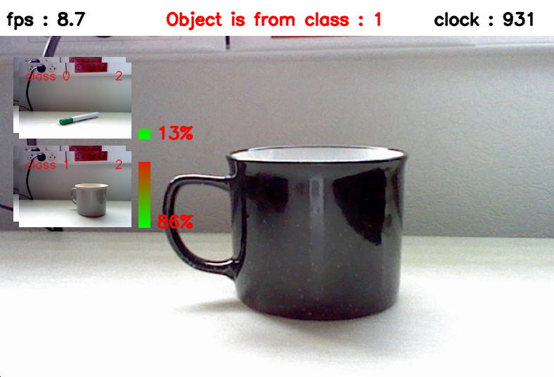

# PEFSL : A Pipeline for Embedded Few-Shot Learning
We propose a modular pipeline for the training, compilation, hardware synthesis and deployment of a few-shot learning application on an FPGA SoC.
This repository contains the code to perform online Few shot Learning with a webcam on FPGA using the [Tensil](https://tensil.ai) framework on the [PYNQ-Z1](http://www.pynq.io/). It also contains the code to evaluate the performance of the network on the dataset cifar-10. Models and algorithms are based on the [EASY paper](https://arxiv.org/abs/2201.09699).

**[News]** PEFSL won the [Xilinx Open Hardware Competition](https://www.openhw.eu/2023-results-gallery) in the Student AI Track!

## This is what it looks like:



There are two steps in the demonstration :
- first you need to take a few shots of the classes you want to recognize
- then you can start the inference

Simple as that !

```
Button 0: take a shot with current class
Button 1: switch to the next class
Button 2: start inference
Button 3: reset the demo
```

# How to install and run the demo on the PYNQ board

## Requirements
- PYNQ-Z1
- Webcam USB
- HDMI screen and cable
- Ethernet cable
- SD card (at least 8GB)
- Micro-USB cable

## Installation
1. Download the [PYNQ-Z1 v2.7 image](https://bit.ly/pynqz1_2_7) and [flash it on the SD card](https://pynq.readthedocs.io/en/v2.7.0/appendix/sdcard.html?highlight=SD%20card#writing-an-sd-card-image) and [get started](https://pynq.readthedocs.io/en/v2.7.0/getting_started/pynq_z1_setup.html).
2. Install tensil tcu on the PYNQ: Start by cloning the [Tensil GitHub repository](https://github.com/tensil-ai/tensil) to your work station and then copy `drivers/tcu_pynq` to `/home/xilinx/tcu_pynq` onto your board.
    ```bash
    git clone git@github.com:tensil-ai/tensil.git
    scp -r tensil/drivers/tcu_pynq xilinx@192.168.2.99:
    ```
3. Copy the hardware (bitstream & metadata) and the tensil model files on the PYNQ. Demo files are available [on this link](https://drive.google.com/file/d/1u2a_PXEhzabauGSO_mkPQRekgvphM5L8/view?usp=sharing).
4. Clone or copy this repository on the PYNQ.

## Run the demo
1. Connect the PYNQ to the screen and the webcam
2. Launch the demo as sudo with environment variables set:

    ```bash
    sudo -E python3 main.py --button-keyboard button --hdmi-display tensil --path_tmodel /home/xilinx/resnet9_strided_16fmaps_onnx_custom_perf.tmodel --path_bit /home/xilinx/design.bit
    ```
3. The demo should be running now on the HDMI screen. You can use the buttons on the PYNQ to interact with the demo as described above.


# How to install and run the demo on your computer
It is also possible to run the demo on your computer using onnx. Example weights are also available [on this link](https://drive.google.com/file/d/1u2a_PXEhzabauGSO_mkPQRekgvphM5L8/view?usp=sharing) under the name `resnet9_strided_16fmaps.pt`:
```bash
python3 main.py pytorch --device-pytorch cpu --path-pytorch-weight resnet9_strided_16fmaps.pt
```

The inputs are the following: {1-4} to register shots for classes {0-3}, i to start inference, r to reset the demo, q to quit.

# How to train a model, convert it to onnx, then to tensil and finally run it on the PYNQ
## Schema of the process


## How to train a backbone model
A repository is available to train a model with pytorch: https://github.com/antoine-lavrard/brain-train/tree/few_shot_demo . It is possible to train a model from scratch.

## Conversion to onnx

The script used to convert the model to onnx is [model_to_onnx.py](model_to_onnx.py). Examples to export backbone from other repository is available in the doctumentation of the file. In order to be exported with this script, the networks must be implemented in the demo. Look at [backbone_loader/backbone_pytorch/model.py](backbone_loader/backbone_pytorch/model.py) for a list of supported models. Thus, for the aforementioned models:
```bash
    python3 model_to_onnx.py --input-resolution 32 --save-name "small-strides-resnet9" --model-type "brain_resnet9_fm16_strided" --model-specification "resnet9_strided_16fmaps.pt"
```
Weights available [on this link](https://drive.google.com/drive/folders/1ftzFL3Byidmls2zS0OdhVA2FBBb2krQR?usp=share_link).

## Conversion to tensil
Once you generated the onnx file for your model, you can generate the tensil model using the script [onnx_to_tensil.py](onnx_to_tensil.py).

docker need to be installed, as well as [docker tensil image](https://hub.docker.com/r/tensilai/tensil). Compilation may take some time (5min on AMD ryzen 5 3350H for the smaller network). All the infos of the compilation of the network is saved to a txt file, for a broad overview, checkout the COMPILER SUMMARY at the end of the file.
```bash
    usage: onnx_to_tensil.py [-h] [--onnx-path ONNX_PATH] [--arch-path ARCH_PATH]
                         [--output-dir OUTPUT_DIR] [--onnx-output ONNX_OUTPUT]

options:
  -h, --help            show this help message and exit
  --onnx-path ONNX_PATH
                        path to onnx file
  --arch-path ARCH_PATH
                        path to tensil architecture file
  --output-dir OUTPUT_DIR
                        path to script output directory
  --onnx-output ONNX_OUTPUT
                        name of the onnx output layer (better to keep default) (default = Output)

```

# Hardware vivado project
The project has been created with Vivado 2020.2. The project is available in the folder `vivado_project`. The project is configured for the PYNQ-Z1 board. The board files can be found in the directory `vivado_project/pynq-z1`. Add them to Vivado by copying it to the directory `Vivado/2020.2/data/boards/board_files`.

Use the tcl script `vivado_project/base.tcl` to generate the project.
```bash
vivado -mode batch -source base.tcl
```

You can then open the project with Vivado and generate the bitstream.

If you want to modify the tensil architecture, replace the verilog files that are in the `vivado_project/base/sources_1/imports/tensil` folder with the ones that you generate with tensil. Then, regenerate the project with the tcl script.
The output files that you will need after the bitstream generation are the following:
- `vivado_project/base/base.runs/impl_1/base_wrapper.bit`
- `base.gen/base/sources_1/bd/base/hw_handoff/base.hwh`

Rename them to respectively to `design.bit` and `design.hwh` and copy them to the PYNQ.

# Possible pitfalls :
    - Sometimes there is a bug with memory allocation (an error is raised). We are investigating it. For now if it happens, just reset the PYNQ.
    - In the PYNQ, always launch the scripts while beeing authentify as root
    - Somethimes PYNQ need to be reset between executions of the program in order to use the hdmi
    - When launching the model, if the tarch used when compiling the model does not correspond to the accelerator, the scripts fail silently.
    - The class id must be sequentialy set (first the 0, then 1, ect...) on the computer

